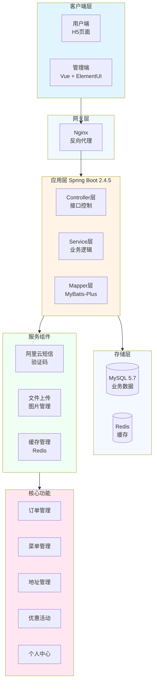

# 😋 Reggie Takeaway - 外卖管理系统


> 一个简单的外卖管理系统,包含用户界面和后台管理

## 📖 项目简介

Reggie Takeaway 是一个使用 JDK8 开发的外卖管理系统,基于 Spring Boot 框架,前端使用 Vue 和 ElementUI,网关层使用 Nginx,数据层使用 MySQL 和 MyBatis Plus、Redis 等。项目包含了用户界面和后台管理界面,提供了完整的订单管理、菜单管理、地址管理等功能。

## 🏗️ 系统架构



## 🛠️ 技术栈

| 技术 | 版本 | 说明 |
|------|------|------|
| **Spring Boot** | 2.4.5 | 核心框架 |
| **Java** | 8 | 开发语言 |
| **MyBatis-Plus** | 3.4.2 | ORM框架 |
| **MySQL** | 5.7 | 数据库 |
| **Redis** | latest | 缓存 |
| **Druid** | 1.1.23 | 数据库连接池 |
| **Vue** | - | 前端框架 |
| **ElementUI** | - | UI组件库 |
| **Nginx** | - | 反向代理 |
| **阿里云短信** | 4.5.16 | 短信服务 |
| **Knife4j** | 3.0.3 | API文档 |

## 📦 核心依赖

### Web层
- `spring-boot-starter-web` - Web开发
- `spring-boot-starter-web-services` - Web服务

### 数据层
- `mybatis-plus-boot-starter` - MyBatis增强
- `mysql-connector-java` - MySQL驱动
- `druid-spring-boot-starter` - Druid连接池

### 缓存层
- `spring-boot-starter-data-redis` - Redis集成
- `spring-boot-starter-cache` - 缓存支持

### 工具层
- `lombok` - 简化代码
- `fastjson` - JSON处理
- `commons-lang` - 工具库

### 服务层
- `aliyun-java-sdk-core` - 阿里云SDK核心
- `aliyun-java-sdk-dysmsapi` - 短信服务

## 🚀 快速开始

### 环境要求
- JDK 8
- Maven 3.6+
- MySQL 5.7
- Redis
- Node.js (前端开发)

### 安装步骤

1. **克隆项目**
```bash
git clone https://github.com/your-username/JOSP-takeAway.git
cd JOSP-takeAway
```

2. **配置数据库**
```sql
CREATE DATABASE reggie_takeaway;
USE reggie_takeaway;
-- 导入SQL脚本
SOURCE db/reggie_takeaway.sql;
```

3. **修改配置**
```yaml
# application.yml
spring:
  datasource:
    driver-class-name: com.mysql.cj.jdbc.Driver
    url: jdbc:mysql://localhost:3306/reggie_takeaway
    username: root
    password: your_password
  redis:
    host: localhost
    port: 6379
```

4. **配置阿里云短信**
```yaml
aliyun:
  sms:
    access-key-id: your_access_key
    access-key-secret: your_secret
    sign-name: your_sign
    template-code: your_template
```

5. **运行项目**
```bash
mvn clean install
mvn spring-boot:run
```

6. **访问服务**
- 后端地址: http://localhost:8080
- API文档: http://localhost:8080/doc.html
- 用户端: http://localhost:8080/front
- 管理端: http://localhost:8080/backend

## 📁 项目结构

```
JOSP-takeAway/
├── src/main/java/
│   └── com/
│       └── reggie/
│           ├── controller/      # 控制器层
│           │   ├── front/       # 用户端接口
│           │   └── backend/     # 管理端接口
│           ├── service/         # 业务逻辑层
│           │   └── impl/
│           ├── mapper/          # 数据访问层
│           ├── entity/          # 实体类
│           │   ├── User.java
│           │   ├── Category.java
│           │   ├── Dish.java
│           │   ├── Setmeal.java
│           │   └── Orders.java
│           ├── common/          # 通用模块
│           │   ├── R.java       # 统一返回
│           │   └── CustomException.java
│           ├── config/          # 配置类
│           │   ├── RedisConfig.java
│           │   └── WebMvcConfig.java
│           ├── filter/          # 过滤器
│           │   └── LoginCheckFilter.java
│           └── utils/           # 工具类
│               ├── SMSUtils.java
│               └── ValidateCodeUtils.java
├── src/main/resources/
│   ├── application.yml          # 主配置
│   ├── backend/                 # 管理端页面
│   └── front/                   # 用户端页面
└── pom.xml
```

## 🎯 核心功能

### 用户端功能
- ✅ **订单查询**: 查看订单、订单状态、取消订单、评价订单
- ✅ **菜单查询**: 查看商家菜单、菜品详情、添加购物车
- ✅ **地址管理**: 查看收货地址、添加新地址、编辑地址
- ✅ **优惠信息**: 查看优惠券、使用规则、折扣信息
- ✅ **个人中心**: 账户信息、修改密码、个人信息管理

### 管理端功能
- ✅ **菜品管理**: 添加菜品、编辑菜品、删除菜品、菜品分类
- ✅ **套餐管理**: 套餐添加、套餐编辑、套餐管理
- ✅ **分类管理**: 菜品分类、套餐分类管理
- ✅ **订单管理**: 订单处理、订单查询、订单统计
- ✅ **员工管理**: 员工添加、权限管理

## 🔧 核心功能实现

### 1. 用户登录验证码
```java
@PostMapping("/sendMsg")
public R<String> sendMsg(@RequestBody User user, HttpSession session) {
    // 生成验证码
    String code = ValidateCodeUtils.generateValidateCode(4);
    // 发送短信
    SMSUtils.sendMessage(accessKeyId, accessKeySecret, 
                         phone, signName, templateCode, code);
    // 保存验证码到Session
    session.setAttribute("code", code);
    return R.success("发送成功");
}
```

### 2. 购物车管理
```java
@PostMapping("/add")
public R<ShoppingCart> add(@RequestBody ShoppingCart shoppingCart) {
    // 设置用户ID
    shoppingCart.setUserId(BaseContext.getCurrentId());
    // 查询当前菜品是否在购物车
    ShoppingCart cart = shoppingCartService.getOne(queryWrapper);
    if (cart != null) {
        // 已存在,数量+1
        cart.setNumber(cart.getNumber() + 1);
        shoppingCartService.updateById(cart);
    } else {
        // 不存在,新增
        shoppingCartService.save(shoppingCart);
        cart = shoppingCart;
    }
    return R.success(cart);
}
```

### 3. 订单处理
```java
@PostMapping("/submit")
public R<String> submit(@RequestBody Orders orders) {
    // 获取用户ID
    Long userId = BaseContext.getCurrentId();
    // 查询购物车数据
    List<ShoppingCart> shoppingCarts = shoppingCartService.list(userId);
    // 创建订单
    orders.setNumber(String.valueOf(System.currentTimeMillis()));
    orders.setStatus(1); // 待付款
    orderService.save(orders);
    // 保存订单明细
    orderDetailService.saveBatch(orderDetails);
    // 清空购物车
    shoppingCartService.remove(userId);
    return R.success("下单成功");
}
```

### 4. Redis缓存优化
```java
@GetMapping("/list")
public R<List<Dish>> list(Dish dish) {
    // 构建Redis key
    String key = "dish_" + dish.getCategoryId() + "_" + dish.getStatus();
    // 查询Redis缓存
    List<Dish> dishList = (List<Dish>) redisTemplate.opsForValue().get(key);
    if (dishList != null) {
        return R.success(dishList);
    }
    // 缓存中没有,查询数据库
    dishList = dishService.list(queryWrapper);
    // 存入Redis
    redisTemplate.opsForValue().set(key, dishList, 60, TimeUnit.MINUTES);
    return R.success(dishList);
}
```

## 📊 数据库设计

### 主要数据表
- **user**: 用户表
- **category**: 分类表
- **dish**: 菜品表
- **setmeal**: 套餐表
- **dish_flavor**: 菜品口味表
- **orders**: 订单表
- **order_detail**: 订单明细表
- **shopping_cart**: 购物车表

## 🔐 安全配置

### 登录检查过滤器
```java
@WebFilter(urlPatterns = "/*")
public class LoginCheckFilter implements Filter {
    @Override
    public void doFilter(ServletRequest request, ServletResponse response, 
                        FilterChain chain) {
        // 检查用户是否登录
        if (session.getAttribute("employee") == null) {
            response.getWriter().write(JSON.toJSONString(R.error("NOTLOGIN")));
            return;
        }
        chain.doFilter(request, response);
    }
}
```

## 📈 性能优化

### 1. 缓存优化
- 使用Redis缓存菜品数据
- 缓存验证码信息
- Session共享方案

### 2. 数据库优化
- 合理使用索引
- 读写分离
- 分页查询

### 3. 并发处理
- 使用Druid连接池
- 配置合理的连接数

## 📝 更新日志

### v1.0.0
- 初始化项目结构
- 完成基础CRUD功能
- 集成Redis缓存
- 集成阿里云短信服务
- 完成订单处理流程
- 完成购物车功能

## 🤝 贡献指南

欢迎提交 Issue 和 Pull Request!

## 📄 许可证

本项目采用 MIT 许可证 - 查看 [LICENSE](LICENSE) 文件了解详情

## 📮 联系方式

- 作者: junw
- Email: wo1261931780@gmail.com
- GitHub: [@wo1261931780](https://github.com/wo1261931780)

## 🙏 致谢

感谢 Spring Boot、MyBatis-Plus、Vue、ElementUI 等开源项目的支持!

---

**说明**: 本项目主要用于学习 Spring Boot + Vue 全栈开发,包含完整的外卖业务流程。适合作为入门级项目学习。
